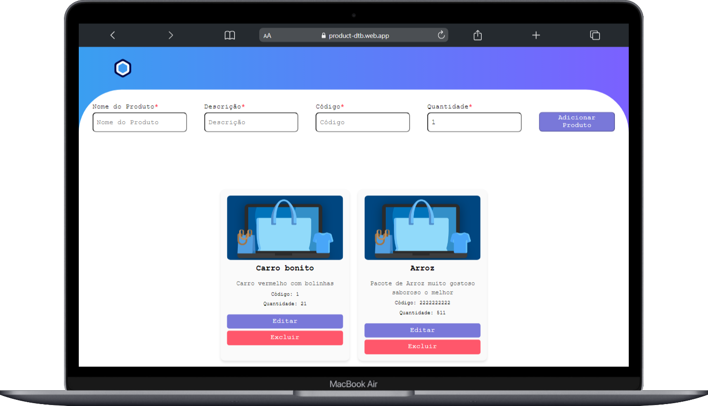

<table align="right">
  <tr>
    <td>
      <a href="README.md">🇧🇷 Português</a>
    </td>
  </tr>
</table>

## Marcos S B Moreira

 

  <a href="#-tecnologias-utilizadas">Tecnologias</a>&nbsp;&nbsp;&nbsp;|&nbsp;&nbsp;&nbsp;
  <a href="#%EF%B8%8F-etapas">Etapas</a>&nbsp;&nbsp;&nbsp;|&nbsp;&nbsp;&nbsp;
  <a href="#-sobre">Sobre</a>&nbsp;&nbsp;&nbsp;|&nbsp;&nbsp;&nbsp;
  <a href="#-páginas-e-rotas">Páginas</a>&nbsp;&nbsp;&nbsp;|&nbsp;&nbsp;&nbsp;
  <a href="#-demais-componentes">Componentes</a>&nbsp;&nbsp;&nbsp;|&nbsp;&nbsp;&nbsp;
  

 

## 🚀 Deploy
https://product-dtb.web.app

## 📝 Pages 

## 📝 Sobre 

Este projeto é uma aplicação desenvolvida com Angular e firebase. 
Ele utiliza o Angular CLI para facilitar o desenvolvimento e oferece uma estrutura modular para melhor organização do código. Além disso, a aplicação é responsiva e otimizada para desempenho.

## 📝 Funcionalidades

Criar Conta no Firebase: Configuração e integração do Firebase para armazenamento de dados.

Adicionar Produto: Permite cadastrar um novo produto com os seguintes campos:

Nome (máximo de 20 caracteres)

Descrição (máximo de 50 caracteres)

Código (máximo de 10 caracteres)

Quantidade (valor numérico inteiro)

Editar Produto: Possibilidade de modificar informações de um produto já cadastrado.

Listar Produtos: Exibição de todos os produtos cadastrados no sistema.

Excluir Produto: Remoção de um produto do banco de dados.

Persistência de Dados: Integração com Firebase para manter os dados salvos e acessíveis entre sessões

## 🚀 Tecnologias Utilizadas

> Abaixo estão as 8 tecnologias utilizadas no desenvolvimento do projeto, e o motivo de usá-las.

<table align="center">
  <tr>
     <td align="center">
      <a href="https://git-scm.com/book/pt-br/v2/Come%C3%A7ando-O-B%C3%A1sico-do-Git">
         
        
          <b>
            <pre>GIT</pre>
          </b>
        
      </a>
      <h6>
        

          
Motivo

           
          <i>Facilidade no controle de versões e trabalho em equipe.</i>
        

      </h6>
    </td>
    <td align="center">
      <a href="https://vercel.com/dashboard">
         
        
          <b>
            <pre>Firebase</pre>
          </b>
        
      </a>
      <h6>
        

          
Motivo

           
          <i>Usado para deploy.</i>
        

      </h6>
    </td>
     <td align="center">
      <a href="https://docs.npmjs.com/">
         
        
          <b>
            <pre>Node</pre>
          </b>
        
      </a>
      <h6>
        

          
Motivo

           
          <i>Como ele usamos o javascript no servidor.</i>
        

      </h6>
    </td>
    <td align="center">
      <a href="https://developer.mozilla.org/en-US/docs/Web/Typescript/">
         
        
          <b>
            <pre>TypeScript</pre>
          </b>
        
      </a>
      <h6>
        

          
Motivo

           
          <i>Ele é a base do React.js.</i>
        

      </h6>
    </td>
    <td align="center">
      <a href="https://developer.mozilla.org/en-US/docs/Web/HTML/">
         
        
          <b>
            <pre>HTML5</pre>
          </b>
        
      </a>
      <h6>
        

          
Motivo

           
          <i>Usado para estruturar as páginas.</i>
        

      </h6>
    </td>
     <td align="center">
      <a href="https://pt-br.reactjs.org/">
         
        
          <b>
            <pre>Angular</pre>
          </b>
        
      </a>
      <h6>
        

          
Motivo

           
          <i>Performace e agilidade na construção das páginas</i>
        

      </h6>
    </td>
  </tr>
</table>

## 🧙‍♀️ Autor

 <a href="https://www.linkedin.com/in/marcos-samuel-batista-m/">
 
  
 <b>Marcos Samuel</b></a>✨</a>
  

---

## 📝 Licença

Feito com ❤️ por:
 
Marcos Samuel [LinkedIn](https://www.linkedin.com/in/marcos-samuel-batista-m/)
 
